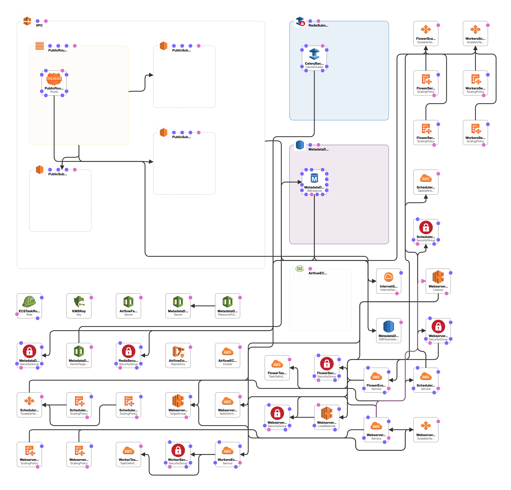
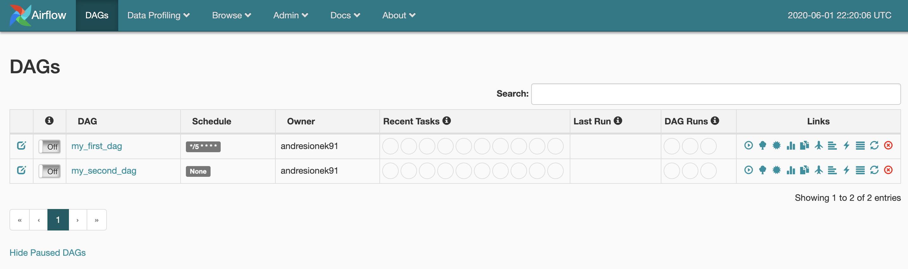
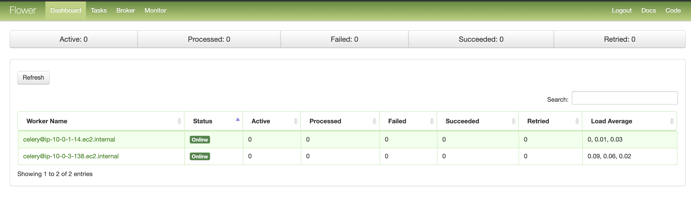

# Airflow Autoscaling ECS

Setup to run Airflow in AWS ECS (Elastic Container Service) Fargate with autoscaling enabled for all services. 
All infrastructure is created with Cloudformation and Secrets are managed by AWS Secrets Manager.



## Requirements
* Create an AWS IAM User for the infrastructure deployment, with admin permissions
* Install AWS CLI running `pip install awscli`
* Install Docker
* Setup your IAM User credentials inside `~/.aws/config`
```
    [profile my_aws_profile]
    aws_access_key_id = <my_access_key_id> 
    aws_secret_access_key = <my_secret_access_key>
    region = us-east-1
```
* Create a virtual environment
* Setup env variables in your .zshrc or .bashrc, or in your the terminal session that you are going to use:
```shell script
	export AWS_REGION=us-east-1;
	export AWS_PROFILE=my_aws_profile;
	export ENVIRONMENT=dev;
```

## Deploy Airflow Locally
```shell script
make airflow-local
```

## Deploy Airflow on AWS ECS
To deploy or update your stack run the following command:
```shell script
make airflow-deploy
```

To rebuild Airflow Docker Image and push it to ECR (without infrastructure changes), run:
```shell script
make airflow-push-image
```

To destroy your stack run the following command:
```shell script
make airflow-destroy
```

## Update a Dag on AWS
After creating or updating a DAG you need to rebuild Airflow image, push it to ECR and then restart the airflow service. To do all that, you just need to execute:
```shell script
make airflow-push-image
```

## Features
* Control all Airflow infrastructure from a single `service.yml` file.
* Metadata DB Passwords Managed with AWS Secrets Manager.
* Autoscaling enabled and configurable for all Airflow sub-services (workers, flower, webserver, scheduler)
* TODO: Continuous Integration using AWS CodePipeline
* TODO: Create isolated DAGs using `docker_operator`

### Adjust many infrastructure configs directly on Service.yml: 
```yaml
  workers:
    port: 8793
    cpu: 1024
    memory: 2048
    desiredCount: 2
    autoscaling:
      maxCapacity: 8
      minCapacity: 2
      cpu:
        target: 70
        scaleInCooldown: 60
        scaleOutCooldown: 120
      memory:
        target: 70
        scaleInCooldown: 60
        scaleOutCooldown: 120
```


### Access to Airflow UI:


Look for AirflowWebServerEndpoint on outputs logged to your terminal.
```
    "cfn-airflow-webserver": [
        {
            "OutputKey": "AirflowWebServerEndpoint",
            "OutputValue": "airflow-dev-webserver-alb-1234567890.us-east-1.elb.amazonaws.com"
        }
    ],
```


### Access to Flower UI:


Look for AirflowFlowerEndpoint on outputs logged to your terminal.
```
    "cfn-airflow-flower": [
        {
            "OutputKey": "AirflowFlowerEndpoint",
            "OutputValue": "airflow-dev-flower-alb-1234567890.us-east-1.elb.amazonaws.com"
        }
    ],
```

*Inspired by the work done by [Nicor88](https://github.com/nicor88/aws-ecs-airflow)*
